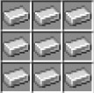

<div align="center">
  <h1>
    
    Gridiron
  </h1>
</div>


## 🚧 Construction Zone 🚧

This project is a work in progress. While I am using it to generate grids for my training projects, it's not yet in a state where it's ready to be used by others and the interfaces should be considered unstable for now. Stay tuned for future updates.

# Gridiron

A powerful tool for generating and analyzing image grids to evaluate diffusion model training, prompting, and parameters.

Current methods for generating image grids have some drawbacks:

- Viewing giant .pngs with dozens or hundreds of images is inconvenient, and with thousands of images it's impractical.
- If you are evaluating the same stuff over and over, you end up generating the same images over and over for different grids
- It's hard or impossible to "zoom in" on individual images in a grid
- Most grid generation tools are limited to a single GPU
- Grid generation UIs leave a lot to be desired
- Grid generation UI based configurations are ephemeral and easy to lose/forget when you want to go back and make a comparison.

Gridiron aims to solve these problems. Grids are expressed using a python based DSL, and all generated images are cached in `~/cache/.gridiron` based on their generation parameters. This means that adding a new row or column to an existing grid is a fast operation, so you can generate grids as part of your model validation without waiting 20 minutes repeating the same work over and over. Because grids are expressed as code, they can be versioned with `git`, and you can revisit a grid generated weeks or months ago to make a tweak or evaluate a new version of a model without starting over.

Grids are generated as self contained `.html` pages, with a set of full-resolution `.png` files sitting next to the `.html`. The html page is browseable. When you click an image it enlarges, and you can use arrow keys or wasd to navigate the grid without leaving the viewer. This makes it practical to create and navigate grids with hundreds or thousands of images.

## Use cases

These are some things I've found Gridiron useful for:

- Comparing models under training at step 500,1000,1500,...
- Comparing different training runs of the same model
- Comparing different prompting strategies
- Comparing different random seeds for a prompt + model

## Roadmap

- Improve the DSL
- Make a `gridiron` command line tool
- Support `gridiron serve` for serving the web page (currently it's bring-your-own-server)
- Support filtering within the web page.
- Support >2 dimensional grids
- Improve web visuals
- Create a way to easily share grids with others

## Installation

```bash
pip install gridiron
```

## Requirements

- Python 3.11+

## License

See [LICENSE](LICENSE) file for details.
